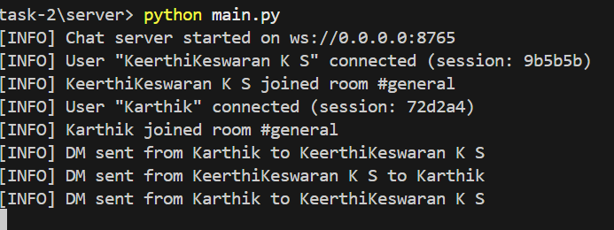
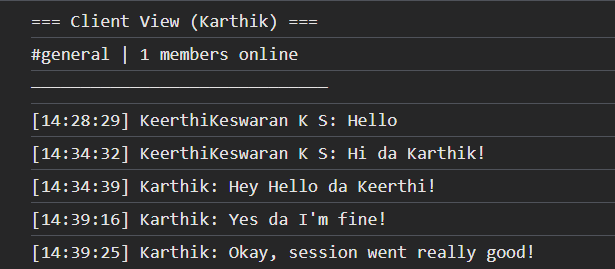

# Real-Time WebSocket Chat Application

## Overview
This project is a high-performance, real-time chat server utilizing the WebSocket protocol in Python, paired with a dynamic vanilla JavaScript Frontend. The application solves common WebSocket fragility by implementing a robust error-handling logic and automated heartbeat system. The user interface aims for a clean, minimalist white layout seamlessly blending private and public interactions.

## Features & Implemented Solutions
- **Connection Stability**: Automatic `ping`/`pong` intervals resolve silent disconnections. Explicit error logging and exception management within `main.py` override the default fail-silently design.
- **Message Persistence**: Refactored `db.py` securely stores all chat logs within a localized SQLite database (`.chat.db`). Fetching the previous 50 messages automatically when a user joins a room.
- **Rich Minimalist UI Engine**: The UI features a flat-white minimalist aesthetic, swapping out complex stylesheets for a highly functional spatial layout prioritizing readability.
- **Advanced Dynamic Functionalities**:
  - **Presence Tracking**: Green indicator dots and a dynamic `(You)` tag to properly classify connection tracking.
  - **Collapsible History**: A left-sidebar maintains a historical record of all recently opened Private Message targets, accessible instantly.
  - **Dynamic Private Chat Panel**: Sliding cleanly into the `Recent Chats` space, direct messaging is physically separated from public room spaces without overriding main workspace interfaces. Type `/dm username message...` or simply click their name to invoke!
  - **Targeted Typing Indicators**: Custom WebSocket routing accurately emits `typing` data back to the recipient without bouncing the flag backward to the initiator or to unintended public rooms.

## Output Logs
### Server Log Example


### Client Log Example


## Requirements
- Python 3.8+
- Modern Web Browser (Chrome, Firefox, Edge, Safari)
- `websockets` Python library

## Dependencies
Install the required asynchronous websocket module via pip referencing the `requirements.txt`:
```bash
pip install -r requirements.txt
```

## Setup Instructions

1. **Start the Connection server:**
   Open a terminal and specify the path to your server directory.
   ```bash
   cd server
   python main.py
   ```
   The backend will safely launch and handle connections via `ws://0.0.0.0:8765`. 

2. **Access the Chat Client:**
   Open the `client/index.html` file using your web browser, or pair it utilizing an extension like *Live Server* for continuous deployment testing. Open the Developer Console (`F12`) to verify programmatic logging.

3. **Interact and Join Rooms!**
   Type a specified username and connect via the UI window to initialize your workspace!
