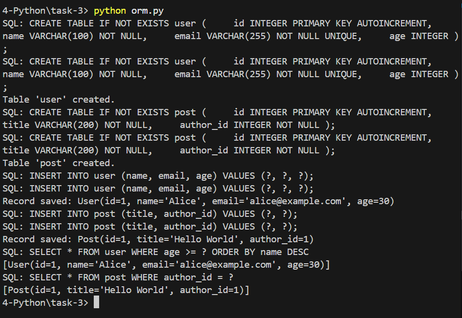

# Custom Python ORM

## Objective
The objective of this task is to design and implement a lightweight Object-Relational Mapper (ORM) from scratch using Python's metaclasses and descriptor protocols. The ORM supports defining models, validating fields, generating querysets utilizing method chaining, executing DML/DDL SQL syntax on SQLite databases, and managing simple `ForeignKey` relationships with lazy loading.

## Implemented Solution
The solution addresses the requirements through a combination of metaclasses, descriptors, class decorators, and standard Python functionality.

- **Descriptors:** Individual field classes (`CharField`, `IntegerField`, `ForeignKey`, `ReverseRelation`) implement `__get__`, `__set__`, and `__set_name__` to encapsulate attribute access, field validation, and database value type resolution.
- **Metaclasses:** A custom metaclass (`ModelMeta`) configures subclass behavior, allowing declarative definition of models and automatically generating database table schemas.
- **Lazy Loading**: `ForeignKey` accesses generate queries dynamically exactly when the relationship is accessed. The model globally registers its subclasses to resolve textual references between models efficiently.
- **Foreign Keys and Reverse Relationships**: Using `ReverseRelation`, you can evaluate relationships natively.
- **Queryset & Method Chaining:** A lightweight `QuerySet` implements `filter`, `order_by`, and `all` patterns seen in fully-featured libraries like Django or SQLAlchemy. 
- **Database Backend:** Simple abstractions map execution routines using the built-in `sqlite3` library.

## Requirements
- Python 3.8+ (for modern metaclasses and type protocols fallback)
- Standard library (`sqlite3`)

## Setup Instructions

1. **Clone the repository / Enter Directory**
Navigate into the `task-3` directory containing the `orm.py` script.

2. **Run the Script**
Simply execute the `.py` script via Python.
```bash
python orm.py
```

## Dependencies
This project uses only **built-in standard library components**. No additional dependencies are required.
- `sqlite3`: Used exclusively for all database interactions and SQL abstractions.

## Runtime Result

