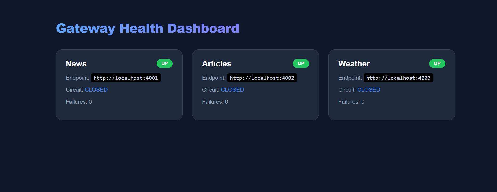
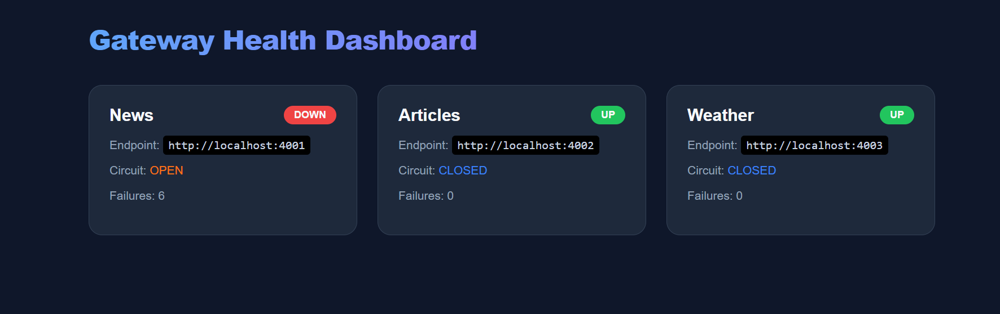

# Task 6: Async API Gateway & Reverse Proxy

This project implements a high-performance, asynchronous API Gateway using Python, FastAPI, and Redis. It serves as a centralized entry point for multiple microservices, providing essential infrastructure features.

## Architecture & Features

- **Asynchronous Reverse Proxy**: Efficiently forwards client requests to downstream services using `aiohttp`.
- **Distributed Caching**: Leveraging **Redis** to cache GET responses, significantly reducing latency and downstream load.
- **Circuit Breaker Pattern**: Prevents cascading failures by monitoring service health and "tripping" the circuit when failure thresholds are met.
- **Rate Limiting**: Protects services from abuse using a sliding window algorithm implemented in Redis.
- **Dynamic Health Dashboard**: A premium HTML5/CSS3 dashboard for real-time monitoring of service status and circuit states.

## Tech Stack

- **Framework**: FastAPI (Asynchronous Python)
- **Communications**: aiohttp (Non-blocking HTTP requests)
- **Data Store**: Redis (Caching & Rate Limiting)
- **Middleware**: Custom Python implementation of Circuit Breakers

## Directory Structure

```text
task-6/
├── core/
│   ├── cache.py           # Redis caching logic
│   ├── circuit_breaker.py # Circuit breaker state machine
│   ├── gateway.py         # Async proxy implementation
│   └── middleware.py      # Rate limiting logic
├── main.py                # Gateway entry point & Dashboard
├── local_services.py      # Mock downstream services
├── test.py                # Functional test suite
└── config.py              # Environment configuration
```

## Setup & Execution

### 1. Prerequisites
- Python 3.10+
- Redis Server (Running on localhost:6379, or WSL)

### 2. Start Downstream Services
Open a terminal and run the mock microservices:
```bash
python local_services.py
```

### 3. Start the API Gateway
Open another terminal and run the gateway:
```bash
python main.py
```

### 4. Run Tests
Validate the implementation:
```bash
python test.py
```

## Monitoring & Dashboard

The gateway provides a premium HTML5/CSS3 dashboard for real-time monitoring of service health and circuit states. Access it at `http://localhost:8000/health`.

### Initial State
When all services are healthy, the dashboard displays a clean green status for all mapped routes.


### Circuit Open State
When a service fails (simulated via the `broken` key), the Circuit Breaker trips to `OPEN`, and the dashboard updates to show the `DOWN` status and failure count.


## Validation Results

The implementation has been verified through a comprehensive test suite (`test.py`):

| Test Case | Description | Result |
| :--- | :--- | :--- |
| **1. Proxying** | Forwarding to News Service | **PASSED** (200 OK) |
| **2. Caching** | Redis Cache Hit verification | **PASSED** (Sub-1ms latency) |
| **3. Rate Limiting** | 30 req/min threshold (Redis-backed) | **PASSED** (Block at 31st request/window) |
| **4. Health API** | Programmatic metrics endpoint | **PASSED** (JSON verified) |
| **5. Circuit Breaker** | Tripping after 5 failures | **PASSED** (503 Service Unavailable) |

> [!TIP]
> To see a perfect Rate Limiting test, run `redis-cli flushall` in WSL before starting the test to ensure you begin at the start of a fresh 60-second window.
